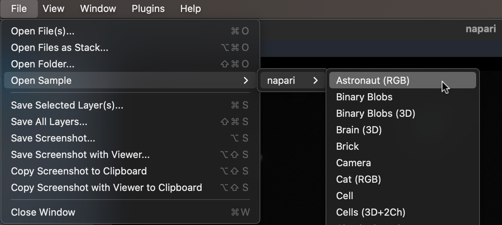
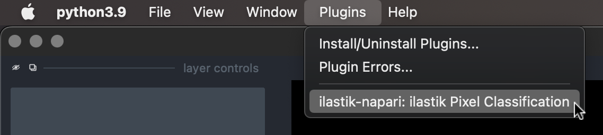
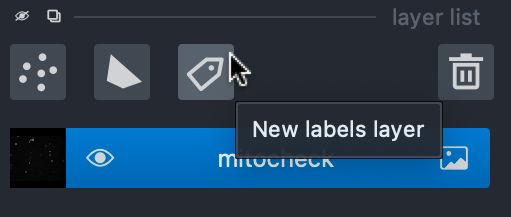
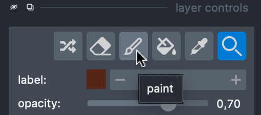
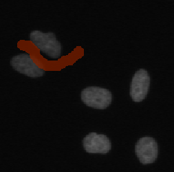
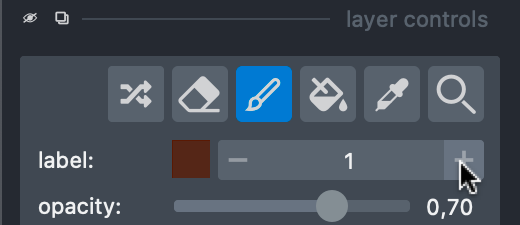
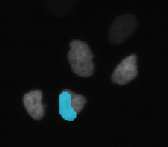
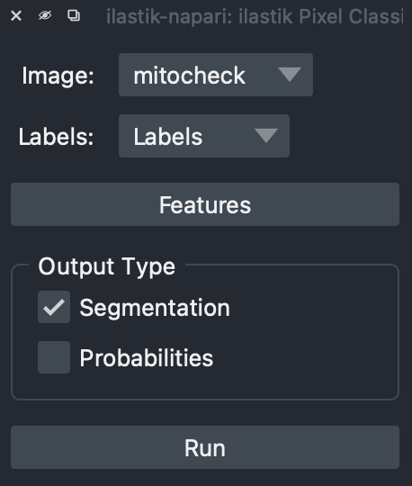
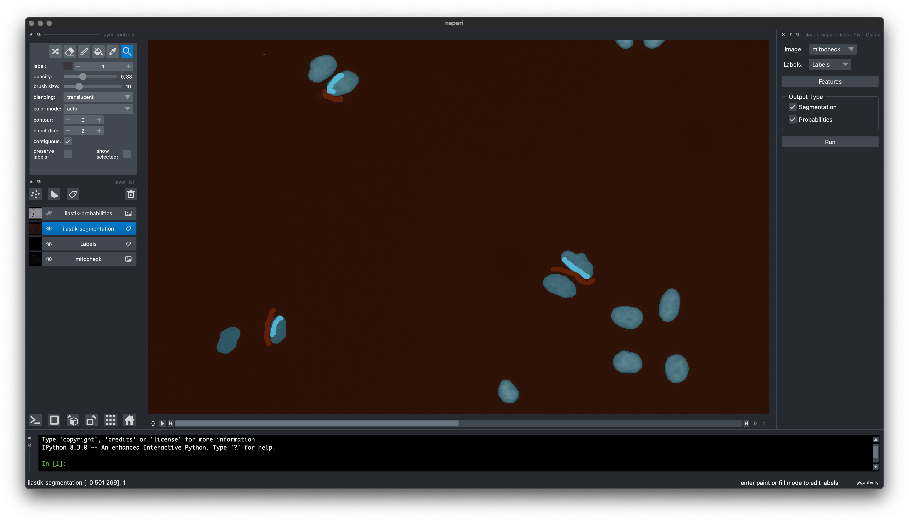

# ilastik-napari

[Napari][napari] plugin for interactive pixel classification.
Designed to be similar to the pixel classification workflow in [classic ilastik][ilastik].

## Installation

Currently, this plugin requires you to use a conda environment.
If you haven't used conda before, please read [conda user guide][conda-user-guide].

Instad of the default [_miniconda_][miniconda] installation, we highly recommend to use [_mambaforge_][mambaforge].
It has better default settings, and the `mamba` command, which is an (almost) drop-in replacement for `conda`.

After installing _mambaforge_, create a new environment with this plugin installed:
   ```shell
   mamba create -y -c ilastik-forge -n my-napari-env napari-ilastik
   ```

Finally, launch napari in the new environment.
   ```shell
   conda activate my-napari-env
   napari
   ```

### Napari Hub and pip

You can also install this plugin via Napari Hub or _pip_. However, in this case you must do that inside a conda environment with the _fastfilters_ package installed:
```shell
mamba create -y -c ilastik-forge -n my-napari-env fastfilters
conda activate my-napari-env
pip install ilastik-napari
```

## Usage

As a prerequisite, make sure you understand the [napari basics][napari-quickstart].

1. Open your image, or use a sample in _File - Open Sample_.

   

2. Activate the plugin in the _Plugins_ menu.

   

3. In _layer list_, create a new _Labels_ layer.

   

4. In _layers control_, switch to the _paint_ action.

   

5. Draw your background labels.

   

6. Switch to a new label.

   

7. Draw your foreground labels.

   

8. Select output types you need, and click _Run_.

   

9. The plugin will create one layer for each output type, which you save as normal napari layers.

   

## Development

Create a development environment:
```
mamba create -y -n ilastik-napari-dev -c ilastik-forge fastfilters setuptools-scm conda-build anaconda-client
conda activate napari-ilastik-dev
pip install -e .
```

Build conda package:
```
conda activate napari-ilastik-dev
mamba build -c ilastik-forge conda-recipe
anaconda upload /path/to/the/new/package.tar.bz2
```

Build wheel and sdist packages:
```
conda activate napari-ilastik-dev
pip install build twine
python -m build
python -m twine upload --repository testpypi dist/*
```

[napari]: https://napari.org/
[ilastik]: https://www.ilastik.org/
[mambaforge]: https://github.com/conda-forge/miniforge#mambaforge
[napari-quickstart]: https://napari.org/tutorials/fundamentals/quick_start.html
